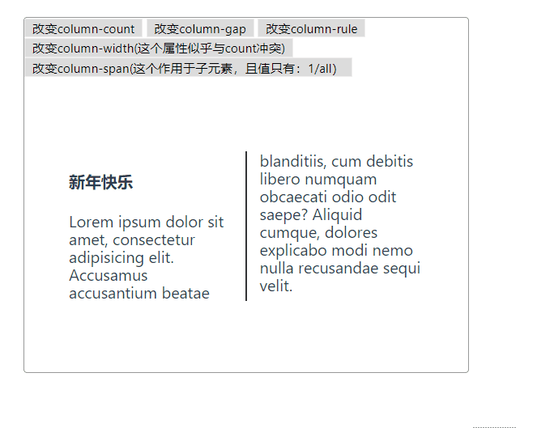

### `column-count` 多列的使用

* `column-count`规定了父元素中的子内容可以以多少列来呈现内容
* 这一特性最早用于报纸的排版（科学家证明，报纸的排版多列是有助于提升读者阅读兴趣的）
* 这一特性也可用于瀑布流（有缺陷，等下会说）

```scss
.columns {
  column-count: 2;
  column-gap: 10px;
  column-rule: 2px solid #333;
  column-width: 100px; // 与column-count 冲突
}
```

