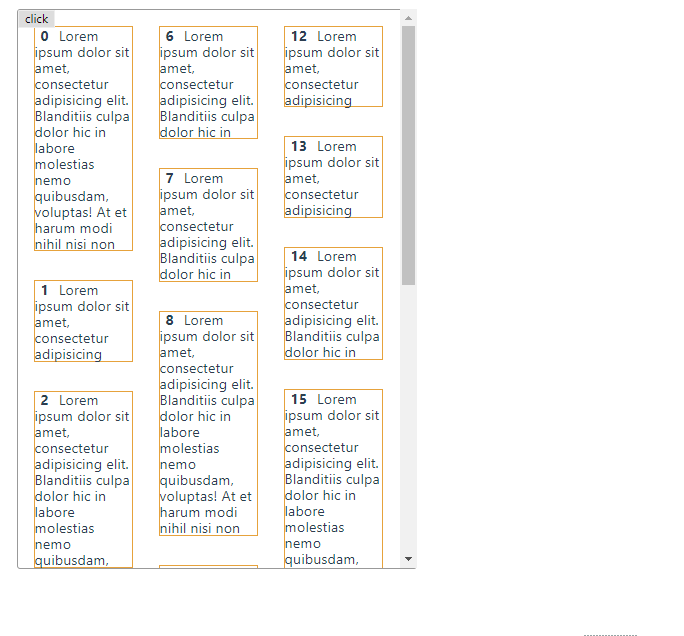
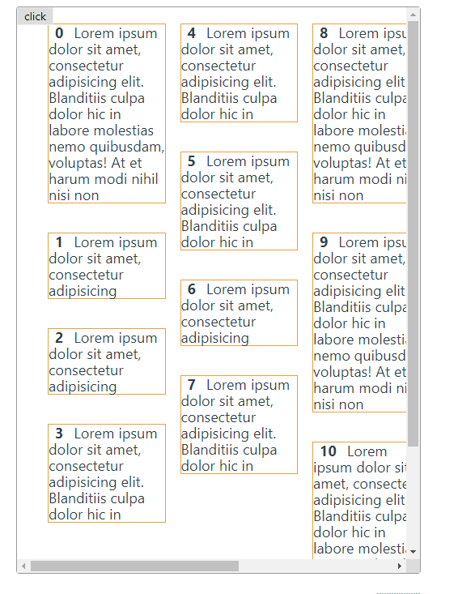

### 瀑布流布局

* 瀑布流在大部分的资讯、购物列表等地方都有应用，能起到激发读者阅读兴致的作用
* 瀑布流的实现的点有：自适应宽度、高度、错落有致、排版合理、能触发下拉事件并实现填补
* 瀑布流可以使用 `column-count` `flexbox` `javascript+absolute`等实现，查看下面的例子
* 并分析优缺点

##### `column-count` 实现布局

* `column-count/column-gap`
* 其中，`waterfall-item`的高度是不固定的（错落）

```html
<div class="waterfall-list">
  <div class="waterfall-item"></div>
</div>
```

```scss
.waterfall-list {
  column-count: 3;  // 重点
  column-gap: 2em;  // 重点
  &-2 {
    column-count: 4;
  }
  &-4 {
    column-count: 5;
  }
}

.waterfall-item {
  break-inside: avoid;
  span {
    font-weight: bold;
    padding: 0 8px;
  }
}
```


##### `flex-box` 布局

* 使用 `flex-direction: column; flex-wrap: wrap;` 来实现，前提是需要提前设置 `water-list` 的高度
* 这个可以进行优化，但总体来说效果仍然不好

```html
<div class="waterfall-list">
  <div class="waterfall-item"></div>
</div>
```

```scss
.waterfall-list {
  display: flex;
  flex-direction: column;
  flex-wrap: wrap;
  height: 800px;
  width: 100%;
}
.waterfall-item {
  margin-bottom: 2em;
  margin-left: 1em;
  width: 33%;
}
```




#### 使用 js 计算兄弟们的宽度、高度进行 `absolute` 布局

* 这是比较常用的，使用 `absolute` 来进行 `top/left` 定位的瀑布流
* 相对上面两种方法，这种需要大量计算，会进行一定量的 dom 操作，但上面两种方案
* 瀑布的流法是先**从上到下**，再**从左到右**
* 而使用 `js + absolute` 则比较自由，可以**从左到右**，一直到**从上到下**
* 比较下面两种处理方案，显然第二种会更加符合自然，而第一种逻辑会更加简单，查看效果分析优劣

```html
<div class="waterfall-list">
  <div class="waterfall-item"></div>
</div>
```

```scss
.waterfall-js {
  .waterfall-list {
    width: 600px;
    box-sizing: border-box;
    position: relative;
    * {
      box-sizing: border-box;
    }
  }
  .waterfall-item {
    box-sizing: border-box;
    display: inline-block;
    width: 200px;   /*可调整成多列，这里举例是3例，实际上要监听 window.onResize 来监听宽度进行多列少列的调整*/
    padding: 10px;
    /*transition: all .5s;*/    // 注意，采用 js 方法，使用transition会有问题，因为 transition 会开展动画，然后无法正常获取兄弟们的 left/top
  }
}
```

```js
handlerWaterList () {
  const listEle = this.$refs.list   // 列表
  const waterfallItems = listEle.getElementsByClassName('waterfall-item')  // 子元素们
  
  for (let i = 0; i < waterfallItems.length; i++) {
    let item = waterfallItems[i]
    let leftItem = {}
    let topItem = {}
    if (i >= 1) {
      leftItem = waterfallItems[i - 1]  // 计算要处理的元素的左边
    }

    if (i >= 3) {
      topItem = waterfallItems[i - 3] // 计算要处理的元素的上面
    }

    item.style.position = 'absolute'  // 先做统一处理
    item.style.left = '0'
    item.style.top = '0'
    
    // 计算 top/left
    if (i % 3 === 1 || i % 3 === 2) {
      item.style.left = (leftItem.offsetWidth + leftItem.offsetLeft) + 'px'   
    }
    if (i - 3 >= 0) {
      item.style.top = (topItem.offsetTop + topItem.offsetHeight) + 'px'
    }
  }
},

handlerWaterList2 () {
  const listEle = this.$refs.list
  const waterfallItems = listEle.getElementsByClassName('waterfall-item')
  let columnsAry = [0, 0, 0]

  for (let i = 0; i < waterfallItems.length; i++) {
    let item = waterfallItems[i]

    item.style.position = 'absolute'

    // i === 0/1/2 要先进行初使化
    // 这里的 left 也是固定计算的，分三例，实际上需要根据 window.Resize 来计算列数跟宽数
    if (i === 0) {
      columnsAry[0] += item.offsetHeight
      item.style.top = '0'
      item.style.left = '0'
    }
    if (i === 1) {
      columnsAry[1] += item.offsetHeight
      item.style.top = '0'
      item.style.left = '200px'
    }
    if (i === 2) {
      columnsAry[2] += item.offsetHeight
      item.style.top = '0'
      item.style.left = '400px'
    }
    let getTheShortColumn = () => {
      let theShort = columnsAry[0]
      let theShortIndex = 0
      for (let i = 0; i < columnsAry.length; i++) {
        if (columnsAry[i] < theShort) {
          theShort = columnsAry[i]
          theShortIndex = i
        }
      }
      return theShortIndex
    }
    
    // i > 2可以根据 columnsAry 的值来计算 left/top
    if (i > 2) {
      let i = getTheShortColumn()
      item.style.left = i * 200 + 'px'
      item.style.top = columnsAry[i] + 'px'
      columnsAry[i] += item.offsetHeight
    }
  }
}
```


